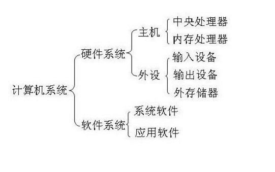

一、Linux发展史
====
### 1.硬件和软件发展历史  
#### 1.1 计算机硬件与软件组成结构
  
#### 1.2 计算机硬件发展史和组成结构  
世界上第一台计算机1946年诞生于美国的宾夕法尼亚州，占地170平方米，重量达到30吨，名字叫做ENIAC(electronic numerical integrator and calculator)主要作用是为美国国防部防空系统计算飞弹轨迹。也是第一代计算机  
**第一代计算机(1946 -- 1957)电子管时代  
第二代计算机(1958 -- 1964)晶体管时代  
第三代计算机(1965 -- 1970)集成电路时代  
第四代计算机(1971 -- )大规模集成电路时代**  
这些计算机都遵循冯诺依曼体系结构  
  
#### 1.3 计算机软件  
软件是一系列按照特定顺序组织的计算机数据和指令的集合。一般来讲软件被划分为系统软件、应用软件和介于这两者之间的中间件。  
_系统软件便是运行在硬件基础上，而应用软件则是运行在系统软件上的_  
  
### 2.Linux发展过程  
#### 2.1 Linux前身-Unix  
**1968年**  Multics项目  
MIT、Bell实验室、美国通用电气有限公司走到了一起，致力于开发Multics项目。到后期由于开发进度不是很好，MIT和Bell实验室相继离开这个项目的开发，最终导致项目搁浅。  

**1970年**（Unix元年，时间戳）  Unix诞生  
当时在开发Multics项目的时候，实验室中有一个开发成员开发了一款游戏（travel space：遨游太空），因为两个实验室相继离开项目开发，导致这名开发人员没法玩游戏，后来他提议组织人员重新在Multics项目之上重新的开发，也就出现了1970年的Unix。当时Unix操作系统是使用的汇编语言（机器语言）开发的。  

**1973年**  用C语言重写Unix  
因为汇编语言有一个最大的局限性：对于计算机硬件过于依赖。导致移植性不好，所以后期在1973年使用了C语言对其进行重新开发。  

**1975年**  Bell实验室允许大学使用Unix。  

**1975年**，bell实验室允许大学使用Unix操作系统用于教学作用，而不允许用于商业用途。  
#### 2.2 Linux诞生 
## 人物  _**Linus**_  
  
Linux的开发作者，Linux之父，李纳斯·托瓦兹。Linux诞生时是荷兰在校大学生。1991年  0.0.1版本，李纳斯当时学校使用的就是Unix操作系统，然后其对系统的底层代码进行了修改，放到了学校为学生开放的网站上，原先他把文件命名写成了Linus’s Unix，后期网络管理发现之后觉得这个名字不好，自己手动的将名字改成Linux。随后其他同学下载之后发现这个版本还是挺好用的，随后都把自己代码贡献给李纳斯。  
1992年  0.0.2版本  
1994年  1.0版本  
2003年  2.6版本  
**`上述所提及的版本号并不是分支版本，而是指Linux的内核版本。`**  
#### 2.3 开源文化  
Linux是开源的操作系统。所谓开源就是指开放源代码。  
人  物  Stallman	斯特曼，开源文化的倡导人。  

1983年  GNU计划  
1985年  FSF基金会  
1990年  Emacs、GCC（c语言的编译器）、程序库    
1991年	 Stallman去找Linus，商谈让Linux加入其开源计划（GNU计划）  
1992年  GNU/Linux  

#### 2.4 Linux系统特点  
开放性（开源）、**多用户、多任务**、良好的用户界面、**优异的性能与稳定性**  

多用户多任务：  
单用户：一个用户，在登录计算机（操作系统），只能允许同时登录一个用户；  
单任务：一个任务，允许用户同时进行的操作任务数量；  
多用户：多个用户，在登录计算机（操作系统），允许同时登录多个用户进行操作；  
多任务：多个任务，允许用户同时进行多个操作任务；  

**Windows属于：单用户、多任务。**  
**Linux属于：多用户、多任务。**  
#### 2.5 Linux分支  
**分支**：Linux分支有很多，现在比较有名的ubuntu、debian、centos（Community Enterprise Operating System）、redhat、suse等等。