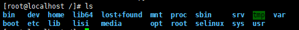
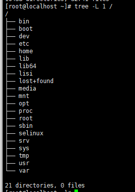
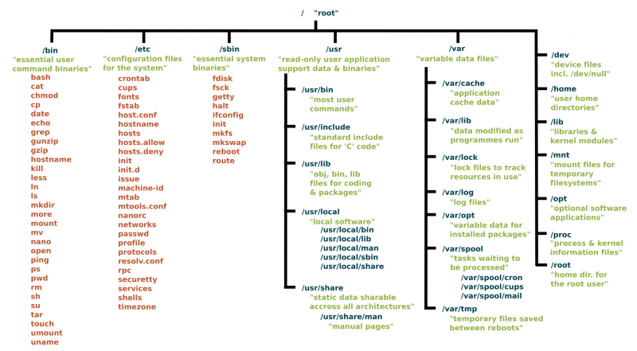

三、Linux系统文件介绍
====
### 1.文件分类
#### ```Linux一切接文件  ```  
①在windows是文件的，在Linux下同样也是文件；  
②在windows不是文件的，在Linux下也是以文件的形式存储的；

（1）普通文件( 数据文件 )  

普通文件是用于存放数据、程序等信息的文件，一般都长期地存放在外存储器（磁盘）中。普通文件又分为文本文件和二进制文件。  

（2）目录文件  

目录文件是文件系统中一个目录所包含的目录项所组成的文件。  

（3）设备文件  

设备文件是用于为操作系统与设备提供连接的一种文件。在Linux系统中将设备作为文件来处理，操作设备就像是操作普通文件一样。每一个设备对应一个设备文件，存放在 /dev 目录中。  

（4）链接文件  

似于 windows 下的快捷方式，链接又可以分为软链接（符号链接）和硬链接。  

（5）管道文件  

管道文件主要用于在进程间传递数据的一种特殊文件。  

（6）套接口文件  

主要用于不同计算机间网络通信的一种特殊文件。  


### 2.Linux系统的文件目录结构
#### 2.1查看Linux系统的根目录结构
方法一:在根路径下通过命令ls可以查看目录结构信息：

>[root@localhost /]# ls    



方法二:在Linux中安装工具:tree进行查看  
CentOS 安装方法:  

>  [root@localhost /]# yum istall tree

Ubuntu 安装方法:  

> [root@localhost /]#sudo apt install tree  

当安装好后在终端输入命令：  
> [root@localhost /]#tree /  

系统中的其他目录都是从根目录分支而出，当你运行 tree 命令，并且告诉它从根目录开始，那么你就可以看到整个目录树，系统中的所有目录及其子目录，还有它们的文件。  

使用命令：  

> [root@localhost /]#tree -L 1 /    

  【图3.2】  

以上命令表示:只显示以 / （根目录）开头的目录树的第一级。-L 选项告诉树你想看到多少层目录  
  
#### 2.2分析目录结构
根据上方【图3.2】对根路径下的目录文件进行分析  

#### bin
bin:全称binary，含义是二进制。该目录中存储的都是一些二进制文件，文件都是可以被运行的。 你会在这个目录中找到上面提到的 ls 程序，以及用于新建和删除文件和目录、移动它们基本工具。  

#### boot  
boot:该目录包含启动系统所需的文件。 不要去动该目录下的文件  

#### dev 
dev:该目录中主要存放的是外接设备，例如盘、其他的光盘等。在其中的外接设备是不能直接被使用的，需要挂载（类似windows下的分配盘符）。  

#### etc
etc:该目录主要存储一些配置文件,相当于系统文件管理员不确定在哪里放置的文件的垃圾场。例如，包含系统名称、用户及其密码、网络上计算机名称以及硬盘上分区的安装位置和时间的文件都在这里。  

#### home
home:表示“家”，表示除了root用户以外其他用户的家目录，类似于windows下的User/用户目录。  

#### lib 
lib:该目录是系统中库文件的所在目录。库是包含应用程序可以使用的代码文件。它们包含应用程序用于在桌面上绘制窗口、控制外围设备或将文件发送到硬盘的代码片段。  
在文件系统周围散布着更多的 lib 目录，但是这个直接挂载在 / 的 /lib 目录是特殊的，除此之外，它包含了所有重要的内核模块。   
内核模块是使你的显卡、声卡、WiFi、打印机等工作的驱动程序。  

#### lost+found
lost+found:该目录是使用标准的ext2/ext3文件系统格式才会产生的一个目录，目的在于当文件系统发生错误时，将一些遗失的片段放置到该目录下。

#### media
media:在该目录下放置的就是可移除的装置， 包括软盘、光盘、DVD等。当你插入外部存储器试图访问它时，将自动挂载它。  

#### mnt 
mnt:该目录是默认的文件系统临时装载点，可以通过手动对存数设备进行挂载。该目录和media作用相同

#### opt
opt:目录用来安装附加软件包，用户调用软件包程序放在目录/opt/package_name/bin下，package_name是安装软件包的名称。  

#### proc
proc:全称process，表示进程，该目录中存储的是Linux运行时候的进程。  

#### root
root:该目录是系统的超级用户（也称为“管理员”）的主目录。  

#### sbin
sbin:全称super binary，该目录也是存储一些可以被执行的二进制文件，但是必须得有super权限的用户才能执行。  

#### selinux
selinux:是一种基于域-类型模型(domain-type)的强制访问控制(MAC)安全系统，它由NSA编写并设计成内核模块包含到内核中，相应的某些安全相关的应用也被打了SELinux的补丁，最后还有一个相应的安全策略。  

#### srv
srv: 该目录存放一些服务启动之后需要提取的数据。
如果你正在 Linux 机器上运行 Web 服务器，你网站的 HTML文件将放到 /srv/http（或 /srv/www）。 如果你正在运行 FTP 服务器，则你的文件将放到 /srv/ftp。  

#### sys
sys:该目录和/proc非常类似，也是一个虚拟的文件系统，主要也是记录与核心相关的信息。包括目前已加载的核心模块与核心侦测到的硬件装置信息等等。该目录同样不占硬盘容量  

#### tmp
tmp:表示“临时”的，当系统运行时候产生的临时文件会在这个目录存着。

#### usr 
usr:存放的是用户自己安装的软件。类似于windows下的program files。  

#### var
var:该目录用于存放的程序/系统的日志文件。

### 2.3基本文件系统的总体概况

