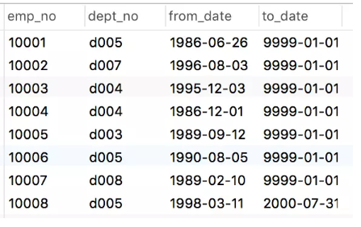
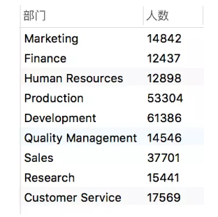
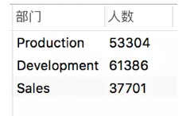

# SQL中GROUP BY用法 


==**GROUP BY**==从字面上理解，**GROUP** 表示分组，**BY**后面写字段名，表示根据哪个字段进行分组

==**GROUP BY**==必须配合聚合函数进行使用

### 常用的聚合函数

+ **count()** ：计数
+ **sum()** ：求和
+ **avg()** ： 平均数
+ **max()** ：最大值
+ **min()**  ：最小值

#### 语法：

```SQL
SELECT column_name, aggregate_function(column_name)
FROM table_name
WHERE column_name operator value
GROUP BY column_name;
```

#### 例子：

我们现在有一张==dept_emp==表共四个字段，分别是==emp_no==(员工编号)，==dept_no==(部门编号)，==from_date==(起始时间)，==to_date==(结束时间)，记录了员工在某一部门所处时间段，to_date等于9999-01-01的表示目前还在职。

  
#### 部门人数

查询每个部门有多少名在职员工，步骤如下：

1. 筛选在职员工 ==where to_date='9999-01-01'==;
2. 对部门进行分组==group by dept_no==
3. 对员工进行计数==count(emp_no)==

#### 代码：

```SQL
SELECT
  dept_no as 部门,
  count( emp_no) as 人数
FROM
  dept_emp 
WHERE
  to_date = '9999-01-01' 
GROUP BY
  dept_no
```

> 结果  

  

####　HAVING

HAVING相当于条件筛选，但它与WHERE筛选不同，HAVING是对于GROUP BY对象进行筛选。

**我们举个例子：**

每个部门人数都有了，那如果我们想要进一步知道员工人数大于30000的部门是哪些，这个时候就得用到==HAVING==了。

**代码：**

```SQL
SELECT
    ( SELECT d.dept_name FROM departments d WHERE de.dept_no = d.dept_no ) AS 部门,
    count( de.emp_no ) AS 人数 
FROM
    dept_emp de 
WHERE
    de.to_date = '9999-01-01' 
GROUP BY
    de.dept_no 
HAVING
    count( de.emp_no ) > 30000 
```

> 结果

  