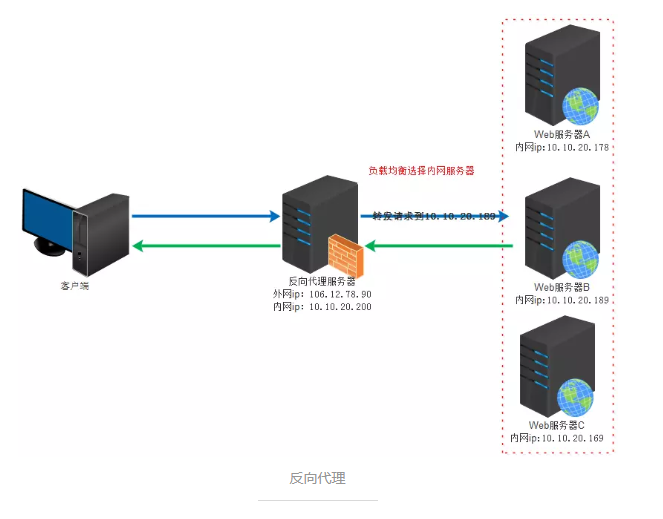
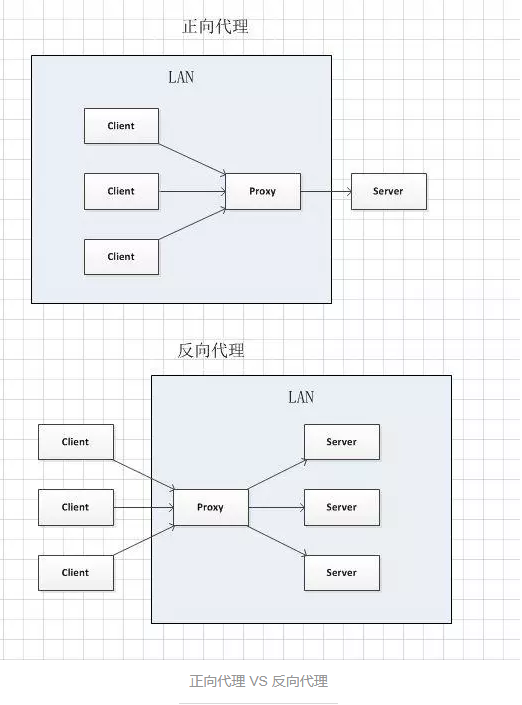

01.正向代理服务器和反向代理服务器
=========
### 一、代理服务器简介
#### 1.什么是代理服务器(Proxy Serve)?  
提供代理服务的电脑系统或其它类型的网络终端，代替网络用户去取得网络信息。  

#### 2.为什么使用代理服务器？
* 提高访问速度  
  由于目标主机返回的数据会存放在代理服务器的硬盘中，因此下一次客户再访问相同的站点数据时，会直接从代理服务器的硬盘中读取，起到了缓存的作用，尤其对于热门网站能明显提高访问速度。  

* 防火墙作用  
  由于所有的客户机请求都必须通过代理服务器访问远程站点，因此可以在代理服务器上设限，过滤掉某些不安全信息。同时正向代理中上网者可以隐藏自己的IP,免受攻击。  

* 突破访问限制  
  互联网上有很多开发的代理服务器，客户机在访问受限时，可通过不受限的代理服务器访问目标站点，通俗说，我们使用的翻墙浏览器就是利用了代理服务器，可以直接访问外网。  

### 二、正向代理  
正向代理：是一个位于客户端和原始服务器(origin server)之间的服务器，为了从原始服务器取得内容，客户端向代理发送一个请求并指定目标(原始服务器)，然后代理向原始服务器转交请求并将获得的内容返回给客户端。  

**客户端必须要进行一些特别的设置才能使用正向代理。**  

#### 正向代理的用途：
* 访问原来无法访问的资源,如Google(翻墙)  
* 可以做缓存，加速访问资源。  

### 三、反向代理 (reverse proxy)
反向代理对外都是透明的，访问者并不知道自己访问的是一个代理。因为客户端不需要任何配置就可以访问。  

_**反向代理是一种可以集中地调用内部服务，并提供统一接口给公共客户的Web服务器。**_  

反向代理的实际运行方式是指以代理服务器来接受连接请求，然后将请求转发给内部网络上的服务器，并将从服务器上得到的结果返回给请求连接的客户端，此时代理服务器对外就表现为一个服务器。  

#### 反向代理的作用：  
* 保证内网的安全。隐藏后端服务器的信息，屏蔽黑名单中的IP,限制每个客户端的连接数。  
* 提高可扩展性和灵活性。客户端只能看到反向代理服务器的IP,这使你可以增减服务器或修改它们的配置。  
* 缓存。直接返回需要访问资源的缓存结果。  
* 静态内容直接返回：
    + HTML/CSS/JS    
    + 图片  
    + 视频  
* 负载均衡，通过反向代理服务器来优化网站的负载  
 

### 四、正向代理和反向代理对比 
  

正向代理中,proxy和client同属于一个LAN(局域网),对server透明.  
反向代理中,proxy和server同属于一个LAN,对client透明.  

实际上proxy在两种代理中做的事都是代为收发请求和响应，不过从结构上来看正好左右互换了下，所以把后出现的那种代理方式叫成了反向代理。  