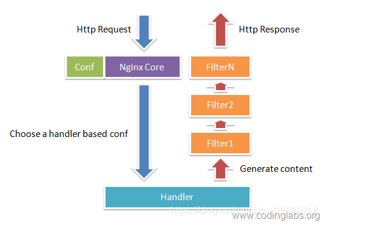
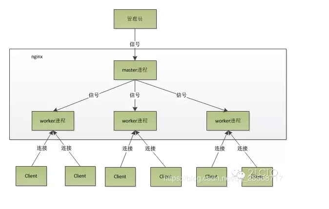

02.Nginx简介
====
### 一、Nginx概述  
Nginx是一款自由的、开源的、高性能的HTTP服务器和反向代理服务器;同时也是一个IMAP、POP3、SMTP代理服务器;Nginx可以作为一个HTTP服务器进行网站的发布处理，另外Nginx可以作为反向代理进行负载均衡的实现。  

### 二、Nginx的优点  
1. 高并发量:根据官方给出的数据，能够支持高达50000个并发连接数的响应  
2. 内存消耗少:处理静态文件，同样起web服务，比apache占用更少的内存及资源  
3. 简单稳定:配置简单，基本在一个conf文件中配置，性能比较稳定，可以7*24小时长时间不间断运行  
4. 模块化程度高:Nginx是高度模块化的设计，编写模块相对简单，包括gzipping,byte ranges,chunked responses,以及SSI-filter等filter,支持SSL和TLSSNI。 
5. 支持Rwrite重写规则:能根据域名、URL的不同，将HTTP请求分发到不同的后端服务器群组。  
6. 低成本:Nginx可以做高并发的负载均衡，且Nginx是开源免费的，如果使用F5等硬件来做负载均衡，硬件成本比较高。  
7. 支持多系统：Nginx代码完全用C语言从头写成，已经移植到许多体系结构和操作系统，包括：Linux、FreeBSD、Solaris、Mac OS X、AIX以及Microsoft Windows，由于Nginx是免费开源的，可以在各系统上编译并使用。  

### 三、Nginx的缺点  
1. 动态处理差:Nginx处理静态文件好，耗费内存少，但是处理动态页面则很鸡肋，现在一般前端用Nginx作为反向代理抗住压力，apache作为后端处理动态请求。  
2. rewrite弱:虽然Nginx支持rewrite功能,但是相比于Apache来说,Apache比Nginx的rewrite 强大。  

### 四、Nginx的模块与工作原理
Nginx由内核和模块组成，其中，内核的设计非常微小和简洁，完成的工作也非常简单，仅仅通过查找配置文件将客户端请求映射到一个location block（location是Nginx配置中的一个指令，用于URL匹配），而在这个location中所配置的每个指令将会启动不同的模块去完成相应的工作。  

#### 1. Nginx的模块划分  
##### Nginx的模块从结构上分为核心模块、基础模块和第三方模块：  
模块 | 介绍 
------ | --------
核心模块 | HTTP模块、EVENT模块和MAIL模块
基础模块 | HTTP Access模块、HTTP FastCGI模块、HTTP Proxy模块和HTTP Rewrite模块
第三方模块 | HTTP Upstream Request Hash模块、Notice模块和HTTP Access Key模块

用户根据自己的需要开发的模块都属于第三方模块。正是有了这么多模块的支撑，Nginx的功能才会如此强大。  

##### 2. Nginx的模块从功能上分为三类
类别 | 功能 
------ | --------
Handlers(处理器模块) | 该类模块直接处理请求，并进行输出内容和修改headers信息等操作(Handlers处理器模块一般只能有一个)
Filters(过滤器模块) | 该类模块主要对其他处理器模块输出的内容进行修改操作，最后由Nginx输出
Proxies(代理类模块) | 该类模块是Nginx的HTTP Upstream之类的模块，这些模块主要与后端一些服务比如FastCGI等进行交互，实现服务代理和负载均衡等功能

Nginx模块常规的HTTP请求和响应的过程如下图所示：  
  

Nginx本身做的工作实际很少，当它接到一个HTTP请求时，它仅仅是通过查找配置文件将此次请求映射到一个location block，而此location中所配置的各个指令则会启动不同的模块去完成工作，因此模块可以看做Nginx真正的劳动工作者。通常一个location中的指令会涉及一个handler模块和多个filter模块（当然，多个location可以复用同一个模块）。handler模块负责处理请求，完成响应内容的生成，而filter模块对响应内容进行处理。  

Nginx的模块直接被编译进Nginx，因此属于静态编译方式。启动Nginx后，Nginx的模块被自动加载，不像Apache，首先将模块编译为一个so文件，然后在配置文件中指定是否进行加载。在解析配置文件时，Nginx的每个模块都有可能去处理某个请求，但是同一个处理请求只能由一个模块来完成  

##### 3. Nginx的进程模块
Nginx在工作方式上，Nginx分为单工作进程和多工作进程两种模式。  
单工作进程：在单工作进程模式下，除主进程外，还有一个工作进程，工作进程是单线程的  
多工作进程：在多工作进程模式下，每个工作进程包含多个线程  
**_Nginx默认为单工作进程模式_**  

##### 4. Nginx启动过程  
Nginx在启动后，会有一个master进程和多个worker进程  

#### master进程：
主要用来管理worker进程，包含：接收来自外界的信号，向各worker进程发送信号，监控worker进程的运行状态，当worker进程退出后(异常情况下)，会自动重新启动新的worker进程  

master进程充当整个进程组与用户的交互接口，同时对进程进行监护。它不需要处理网络事件，不负责业务的执行，只会通过管理worker进程来实现重启服务、平滑升级、更换日志文件、配置文件实时生效等功能。  

我们要控制nginx，只需要通过kill向master进程发送信号就行了。比如kill -HUP pid，则是告诉nginx，从容地重启nginx，我们一般用这个信号来重启nginx，或重新加载配置，因为是从容地重启，因此服务是不中断的。master进程在接收到HUP信号后是怎么做的呢？首先master进程在接到信号后，会先重新加载配置文件，然后再启动新的worker进程，并向所有老的worker进程发送信号，告诉他们可以光荣退休了。新的worker在启动后，就开始接收新的请求，而老的worker在收到来自master的信号后，就不再接收新的请求，并且在当前进程中的所有未处理完的请求处理完成后，再退出。当然，直接给master进程发送信号，这是比较老的操作方式，nginx在0.8版本之后，引入了一系列命令行参数，来方便我们管理。比如，./nginx -s reload，就是来重启nginx，./nginx -s stop，就是来停止nginx的运行。如何做到的呢？我们还是拿reload来说，我们看到，执行命令时，我们是启动一个新的nginx进程，而新的nginx进程在解析到reload参数后，就知道我们的目的是控制nginx来重新加载配置文件了，它会向master进程发送信号，然后接下来的动作，就和我们直接向master进程发送信号一样了。  

#### worker进程:
而基本的网络事件，则是放在worker进程中来处理了。多个worker进程之间是对等的，他们同等竞争来自客户端的请求，各进程互相之间是独立的。一个请求，只可能在一个worker进程中处理，一个worker进程，不可能处理其它进程的请求。worker进程的个数是可以设置的，一般我们会设置与机器cpu核数一致，这里面的原因与nginx的进程模型以及事件处理模型是分不开的。  

worker进程之间是平等的，每个进程，处理请求的机会也是一样的。当我们提供80端口的http服务时，一个连接请求过来，每个进程都有可能处理这个连接，怎么做到的呢？首先，每个worker进程都是从master进程fork过来，在master进程里面，先建立好需要listen的socket（listenfd）之后，然后再fork出多个worker进程。所有worker进程的listenfd会在新连接到来时变得可读，为保证只有一个进程处理该连接，所有worker进程在注册listenfd读事件前抢accept_mutex，抢到互斥锁的那个进程注册listenfd读事件，在读事件里调用accept接受该连接。当一个worker进程在accept这个连接之后，就开始读取请求，解析请求，处理请求，产生数据后，再返回给客户端，最后才断开连接，这样一个完整的请求就是这样的了。我们可以看到，一个请求，完全由worker进程来处理，而且只在一个worker进程中处理。  

Nginx的进程模型，可以由下图来表示：  
  