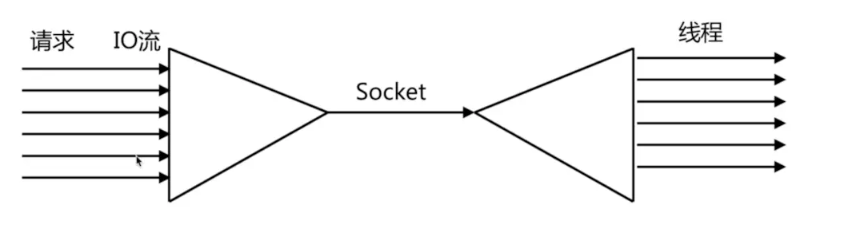
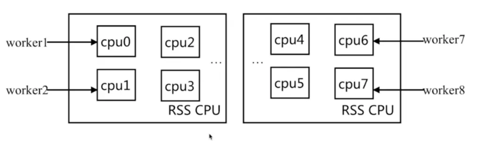
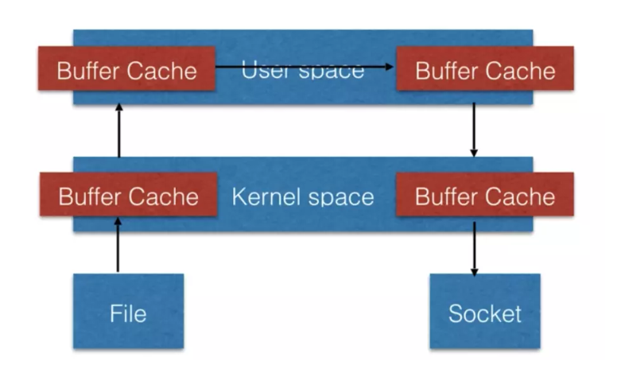
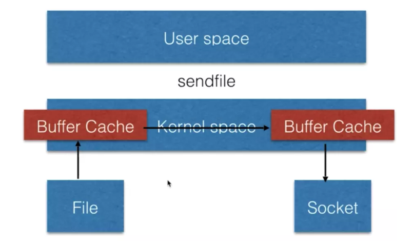

05.Nginx特性介绍
====
### 一、IO多路复用epoll  
IO多路复用：多个描述符的I/O操作都能在一个线程内并发交替地顺序完成  
复用：指复用同一个线程  
  

### 二、轻量级
1. 功能模块少：源代码里只有核心代码，其他代码以插件形式安装  
2. 代码模块化：适合二次改进  

### 三、CPU亲和(affinity)
nginx正是利用到了cpu的亲和来提高并发处理能力以及减少不必要的cpu损耗。  

#### 1.CPU亲和介绍
CPU亲和：是一种把CPU核心和Nginx工作进程绑定方式，把每个worker进程固定在一个cpu上执行，减少cpu的cache miss，获得更好的性能。  

#### 2.CPU亲和的好处  
nginx作为接入层的中间件，nginx通过多个work进程进行处理。  
假设我们主机是两个CPU，每个有四个核心，我们把CPU的八个进程分别绑定到不同的CPU上（也就是不同的work分配到不同的核心上）。如果有多个CPU利用自带的CPU切换，会造成性能损失。利用这种CPU的亲和绑定，就能减少切换的损耗。  
   

### 四、sendfile  
在传统的http服务中，当我们访问一个文件时，会先经过内核空间，再经过用户空间，传给socket，最后通过response返回给用户。该过程需要多次与用户空间进行切换，但是静态文件其实不需要与用户空间进行过多的逻辑处理。直接可以通过内核空间传输。  
  
sendfile机制只通过内核空间，将文件传给socket，最终响应给用户  
    
因此nginx在处理CDN和动静分离服务时有很大优势。